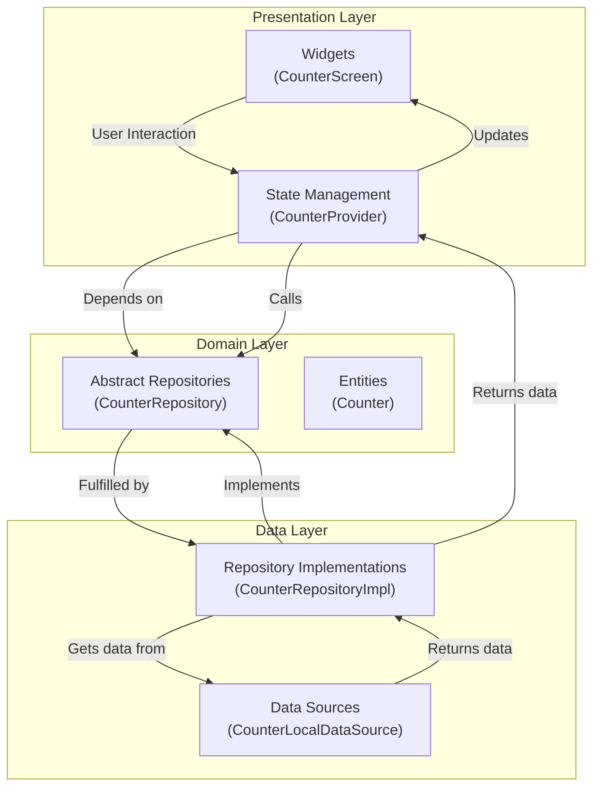

# Structured Counter App

This project is a refactored version of the default Flutter counter application, built with a scalable and maintainable architecture. It serves as an educational example of how to structure a Flutter application for growth, testability, and clear separation of concerns.

## Architecture: Simplified Clean Architecture

This project follows the principles of **Clean Architecture**, adapted for a small-scale Flutter application. The core idea is to separate the code into independent layers, with a strict dependency rule: **inner layers should not know anything about outer layers**.

Our architecture is divided into three main layers:

1.  **Presentation**: The UI layer of the application (Widgets and State Management).
2.  **Domain**: The core business logic and rules of the application (Entities and Abstract Repositories).
3.  **Data**: The implementation of data retrieval and storage (Repository Implementations and Data Sources).

### Architecture Diagram



### Data Flow

The data flows from the outer layers to the inner layers, and the dependencies point inwards.

1.  **UI Interaction**: A user interacts with a Widget (e.g., presses a button).
2.  **State Management**: The Widget calls a method on the state management class (e.g., `CounterProvider`).
3.  **Repository Interface**: The provider calls a method on the abstract repository in the Domain layer.
4.  **Repository Implementation**: The dependency injection provides the concrete implementation from the Data layer.
5.  **Data Source**: The repository implementation gets data from a data source (local or remote).
6.  **Return Flow**: The data flows back up the chain, updating the UI.

## Folder Structure

The `lib` directory is structured to reflect the architecture:

```
lib/
├── src/
│   ├── data/
│   │   ├── datasources/
│   │   │   └── counter_local_data_source.dart
│   │   └── repositories/
│   │       └── counter_repository_impl.dart
│   ├── domain/
│   │   ├── entities/
│   │   │   └── counter.dart
│   │   └── repositories/
│   │       └── counter_repository.dart
│   └── presentation/
│       ├── providers/
│       │   └── counter_provider.dart
│       └── screens/
│           └── counter_screen.dart
└── main.dart
```

## Layer-by-Layer Breakdown

### 1. Domain Layer

This is the core of the application. It is completely independent of any other layer and contains only pure business logic.

- **Entities**: Plain Dart objects representing the core data structures.

  _`lib/src/domain/entities/counter.dart`_

  ```dart
  /// Represents the counter entity.
  class Counter {
    int value;

    Counter(this.value);
  }
  ```

- **Repositories (Abstract)**: Interfaces that define the contract for data operations. The domain layer does not care _how_ the data is fetched, only that it _can_ be fetched.

  _`lib/src/domain/repositories/counter_repository.dart`_

  ```dart
  import 'package:structured_counter_app/src/domain/entities/counter.dart';

  /// Abstract repository for counter operations.
  abstract class CounterRepository {
    /// Gets the current counter value.
    Future<Counter> getCounter();

    /// Increments the counter value.
    Future<void> incrementCounter();
  }
  ```

### 2. Data Layer

This layer implements the abstract repositories defined in the domain layer. It handles the actual data fetching, whether from a database, a network API, or in-memory storage.

- **Data Sources**: Responsible for fetching raw data. For this app, we use a simple in-memory data source.

  _`lib/src/data/datasources/counter_local_data_source.dart`_

  ```dart
  import 'package:structured_counter_app/src/domain/entities/counter.dart';

  /// Implementation of the local data source that stores the counter in memory.
  class CounterLocalDataSourceImpl implements CounterLocalDataSource {
    int _counter = 0;

    @override
    Future<Counter> getCounter() async {
      return Counter(_counter);
    }

    @override
    Future<void> incrementCounter() async {
      _counter++;
    }
  }
  ```

- **Repository Implementations**: Concrete implementations of the repository interfaces from the domain layer. They use data sources to get the data.

  _`lib/src/data/repositories/counter_repository_impl.dart`_

  ```dart
  import 'package:structured_counter_app/src/data/datasources/counter_local_data_source.dart';
  import 'package:structured_counter_app/src/domain/entities/counter.dart';
  import 'package:structured_counter_app/src/domain/repositories/counter_repository.dart';

  class CounterRepositoryImpl implements CounterRepository {
    final CounterLocalDataSource localDataSource;

    CounterRepositoryImpl(this.localDataSource);

    @override
    Future<Counter> getCounter() {
      return localDataSource.getCounter();
    }

    @override
    Future<void> incrementCounter() {
      return localDataSource.incrementCounter();
    }
  }
  ```

### 3. Presentation Layer

This is the user-facing layer, containing all the UI elements and state management logic.

- **State Management (Provider)**: The `CounterProvider` acts as a ViewModel. It communicates with the domain layer and exposes the state to the UI. We use `ChangeNotifier` with the `provider` package for its simplicity and efficiency.

  _`lib/src/presentation/providers/counter_provider.dart`_

  ```dart
  import 'package:flutter/material.dart';
  import 'package:structured_counter_app/src/domain/repositories/counter_repository.dart';

  class CounterProvider extends ChangeNotifier {
    final CounterRepository repository;

    int _counter = 0;
    int get counter => _counter;

    CounterProvider({required this.repository}) {
      _loadCounter();
    }

    void _loadCounter() async {
      final counter = await repository.getCounter();
      _counter = counter.value;
      notifyListeners();
    }

    void increment() async {
      await repository.incrementCounter();
      final counter = await repository.getCounter();
      _counter = counter.value;
      notifyListeners();
    }
  }
  ```

- **Widgets (Screen)**: The UI components that the user sees. They listen to the provider for state changes and rebuild accordingly.

  _`lib/src/presentation/screens/counter_screen.dart`_

  ```dart
  import 'package:flutter/material.dart';
  import 'package:provider/provider.dart';
  import 'package:structured_counter_app/src/presentation/providers/counter_provider.dart';

  class CounterScreen extends StatelessWidget {
    // ... build method ...
    body: Center(
      child: Column(
        mainAxisAlignment: MainAxisAlignment.center,
        children: <Widget>[
          const Text('You have pushed the button this many times:'),
          Consumer<CounterProvider>(
            builder: (context, provider, child) => Text(
              '${provider.counter}',
              style: Theme.of(context).textTheme.headlineMedium,
            ),
          ),
        ],
      ),
    ),
    floatingActionButton: FloatingActionButton(
      onPressed: () => Provider.of<CounterProvider>(context, listen: false).increment(),
      tooltip: 'Increment',
      child: const Icon(Icons.add),
    ),
  }
  ```

## Dependency Injection

Dependencies are provided to the layers that need them. In this project, we use a simple manual dependency injection setup in `main.dart`.

_`lib/main.dart`_

```dart
void main() {
  // 1. Data Layer
  final CounterLocalDataSource localDataSource = CounterLocalDataSourceImpl();
  final CounterRepository repository = CounterRepositoryImpl(localDataSource);

  // 2. Presentation Layer
  runApp(
    ChangeNotifierProvider(
      create: (context) => CounterProvider(
        repository: repository,
      ),
      child: const MyApp(),
    ),
  );
}
```

## Testing

The architecture makes the app highly testable. We can test each layer in isolation.

- **Widget Testing**: We can test the UI and its interaction with the provider.

  _`test/widget_test.dart`_

  ```dart
  void main() {
    testWidgets('Counter increments smoke test', (WidgetTester tester) async {
      // Dependencies
      final CounterLocalDataSource localDataSource = CounterLocalDataSourceImpl();
      final CounterRepository repository = CounterRepositoryImpl(localDataSource);

      // Build our app
      await tester.pumpWidget(
        ChangeNotifierProvider(
          create: (context) => CounterProvider(repository: repository),
          child: const MaterialApp(home: CounterScreen()),
        ),
      );

      // Verify initial state
      expect(find.text('0'), findsOneWidget);

      // Tap the button
      await tester.tap(find.byIcon(Icons.add));
      await tester.pump();

      // Verify updated state
      expect(find.text('1'), findsOneWidget);
    });
  }
  ```

## How to Run

1.  **Clone the repository:**
    ```sh
    git clone https://github.com/moyeenhaider3/structured_counter_app.git
    ```
2.  **Navigate to the project directory:**
    ```sh
    cd structured_counter_app
    ```
3.  **Install dependencies:**
    ```sh
    flutter pub get
    ```
4.  **Run the app:**
    ```sh
    flutter run
    ```
5.  **Run the tests:**
    ```sh
    flutter test
    ```
